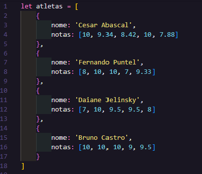
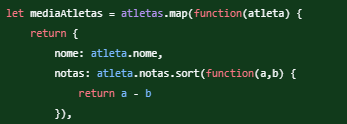
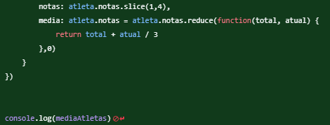

# Programa calcular média de nota de Atletas

Este programa foi criado com a finalidade de facilitar o cálculo da média de notas dos atletas em qualquer contexto de qualquer competição aplicado, contanto que:

- Tenha no máximo 5 notas por cada atleta.

## Como usar?
Primeiro você deve definir os Atletas, dando nome e uma matriz de notas a ele. A criação dos atletas se baseia numa matriz de objetos, onde cada objeto é um atleta.

## Como funciona?

A seguir você poderá acompanhar o funcionamento do programa para compreender melhor o seu funcionamento.

### Passo 1 - Definição de Atletas

Aqui é onde fica a definição dos atletas e suas respectivas notas, você pode alterar o nome deles e/ou suas notas que o programa continuará funcionando utilizando os dados que você forneceu a ele.

### Passo 2 - Processamento das Informações

Nesta parte nós criamos uma cópia da matriz original de objetos (Atletas) e criamos uma segunda matriz modificando os elementos da matriz original utilizando o método `.map()`.

Apenas fizemos uma transformação na segunda chave (notas) do objeto Atletas. Pegamos as notas do Atleta e a ordenamos em ordem numérica crescente utilizando o método `.sort()`

### Passo 3 - Somando o total e dividindo

Aqui utilizamos o método `.slice()` para cortar fora da conta a menor nota e a maior nota do atleta conforme requisitado na atividade. Como já havíamos ordenando por ordem crescente, esta solução funcionará perfeitamente neste contexto.

Logo em seguida nós adicionamos uma nova chave ao objeto Atleta chamada "media". Dentro dessa nova chave nós utilizamos o método `.reduce()` para somar todas as notas que sobraram depois do `.slice()`. Após isso, obteremos o resultado total de todas as notas restantes somadas e na mesma conta a dividimos por 3, que foi o número de notas restantes.

### Conclusão
Desta forma, obtemos o resultado que queríamos conforme os critérios repassados da atividade.